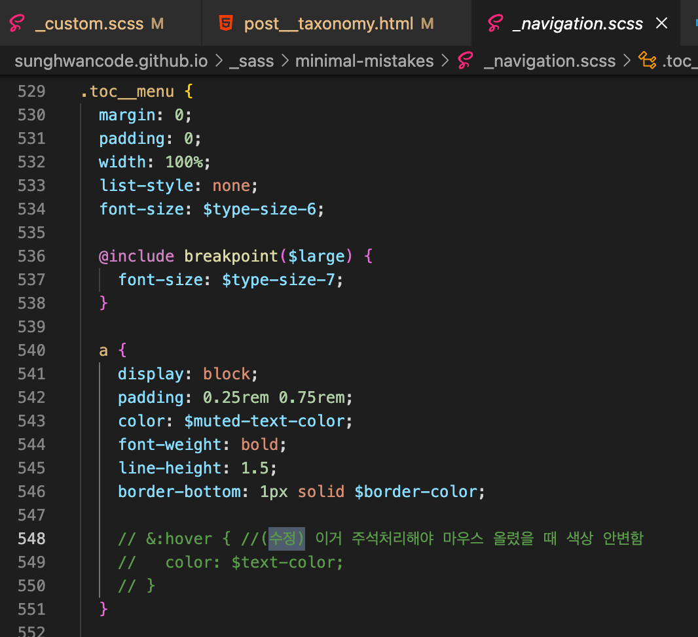
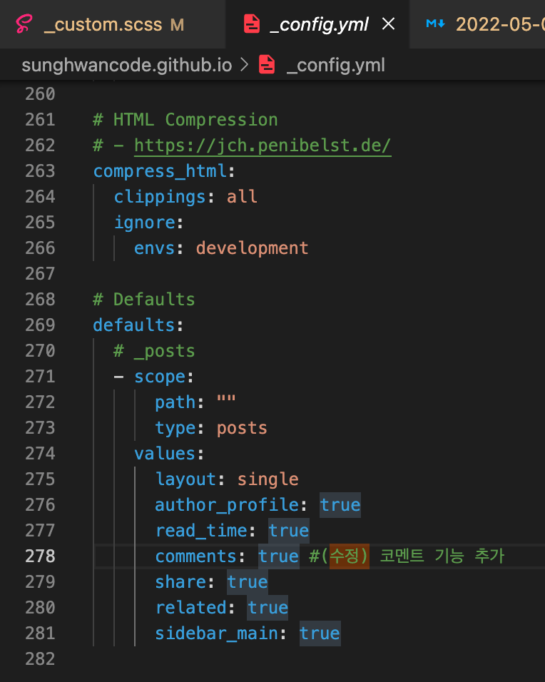

드디어 처음으로 github로 블로그를 만들었다. 생각보다 어려운 부분이 많았는데,  
만들면서 내가 만났던 문제와 꾸미는 방법들을 정리해보려고 한다.

<a href="https://ansohxxn.github.io/categories/blog">Github Blog 제작 가이드 (공부하는 식빵맘님 블로그)</a>

---

### 오류

* #### 지킬(jekyll) 설치 중 webrick 오류  

블로그 제작중에 ```bundle exec jekyll serve``` 를 터미널에 입력해야하는 단계가 있는데, 이 때 ```bundle add webrick``` 을 입력해주면 해결이 된다.  
(Ruby 3.0.0부터 기본 설치 패키지에 Webrick 포함되지 않기 때문에 직접 설치해주어야 한다고 한다.)  

<center>

</center>

---

### 꾸미기 팁
블로그를 제작할 때 수정한 부분은 최대한 주석처리하면서 기록해놨으니, 나의 블로그와 비슷하게 만들고 싶은 부분은 sunghwancode.github.io 레포지토리에서 '수정' 이라고 검색하면 확인할 수 있다. <a href="https://github.com/sunghwancode/sunghwancode.github.io/search?q=%EC%88%98%EC%A0%95"> <b>🔍 확인해보기</b></a>

어느 파일에서 수정해야하는지 파일명도 참고하자.

#### 폰트
* #### 폰트 크기 변경하기
<center>

</center>

* #### 폰트 색상 변경하기
<center>

</center>

* #### 폰트 색상 일정하게 표시되도록하기
  만약 내가 설정한 색상과 다르게 표시되는 부분이 있다면 아래 두가지 작업을 진행해보자.  
<center>

</center>
<center>

</center>


#### 그 외
* #### 코드 블럭의 배경색 설정
<center>

</center>

* #### 카테고리 표시 개수 설정
<center>

</center>

* #### 코멘트 기능 추가시 설정
  <a href="https://ansohxxn.github.io/blog/utterances/">코멘트 기능 추가하는 방법</a>  
<center>

</center>