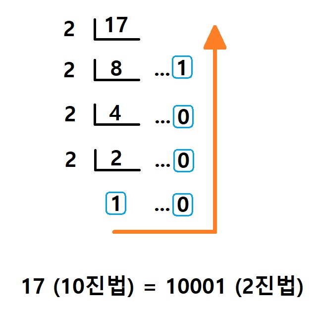

### 진법이란
진법이란 제한된 숫자(정수) 만으로 수를 세는 법을 말한다.
ex)
2진법 : 0과 1로만 이루어짐
4진법 : 0~3 의 숫자로만 이루어짐
10진법 : 0~9 의 숫자로만 이루어짐

우리가 일반적으로 사용하는 숫자는 10진법이다.

10진법의 숫자 17을, 2진법으로 구현하려면 아래와 같이 진행해야 한다.
<center>

</center>

---
### toString() 을 이용해서 진법 바꾸기

* <a href="https://developer.mozilla.org/ko/docs/Web/JavaScript/Reference/Global_Objects/Number/toString"><b>toString()</b></a>
>toString() 메소드는 특정 진수로 객체를 표현한 문자열을 환원합니다.

```javascript
const number = 17;

//10진법
console.log(number.toString()) // "10" (기본값은 10진수로 표현된다.)
console.log(number.toString(10)) // "10"

//2진법
console.log(number.toString(2)) // "10001"

//5진법
console.log(number.toString(5)) // "32"
```

* <a href="https://developer.mozilla.org/ko/docs/Web/JavaScript/Reference/Global_Objects/parseInt"><b>parseInt()</b></a>
특정한 숫자 값을 다른 진수로 변환할 수 있게 해준다.
```javascript
const _2진법 = "10001"
const _5진법 = "32"

console.log(parseInt(_2진법, 2)) // 17
console.log(parseInt(_5진법, 5)) // 17

// 2진수에서 9진수로 변환하기
console.log(parseInt(_2진법, 2).toString(9)) // "18"
```

---

### 재귀함수를 통해서 진법 계산하기 (2진법)

```javascript
const 진법 = 2

function binary(number){
  let result = ""

  function calculate(num){
    if(num === 0) return ''
    calculate(Math.floor(num / 진법))
    result += num % 진법
  }
  
  calculate(number)
  
  return result
}

binary(4) // "100"
binary(13) // "1101"
binary(17) // "10001"
```
