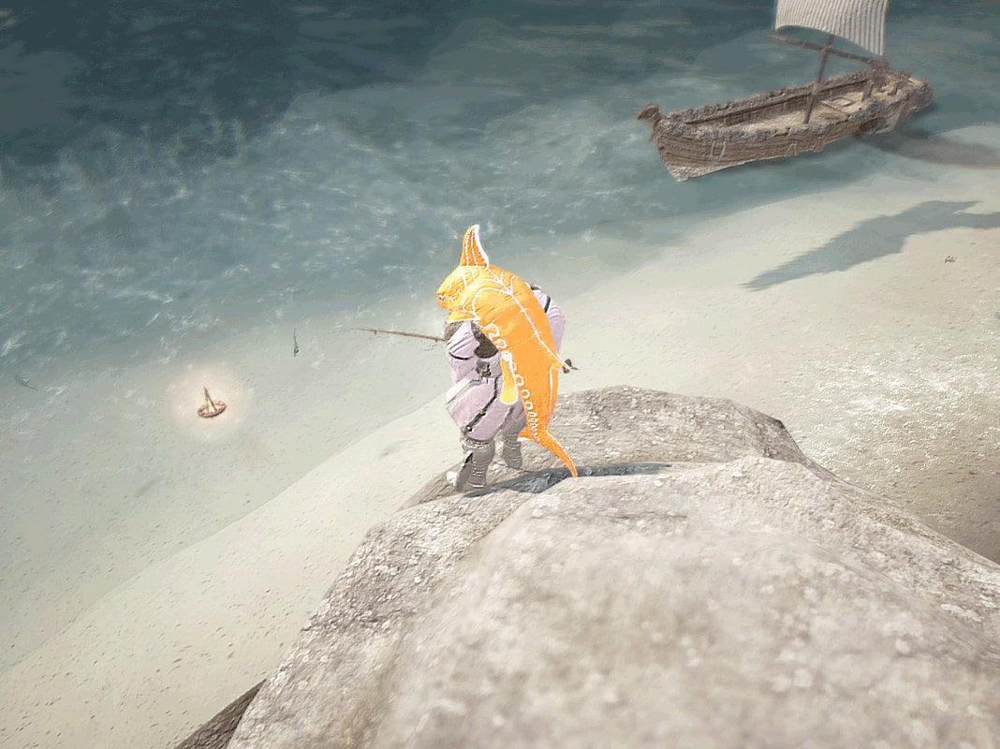
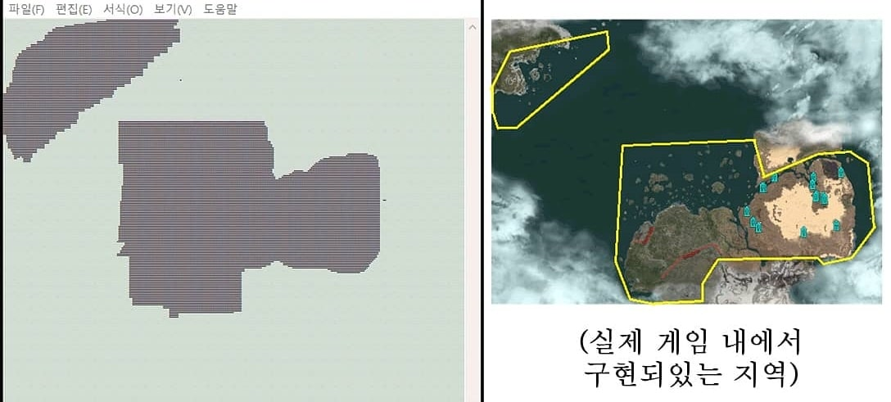
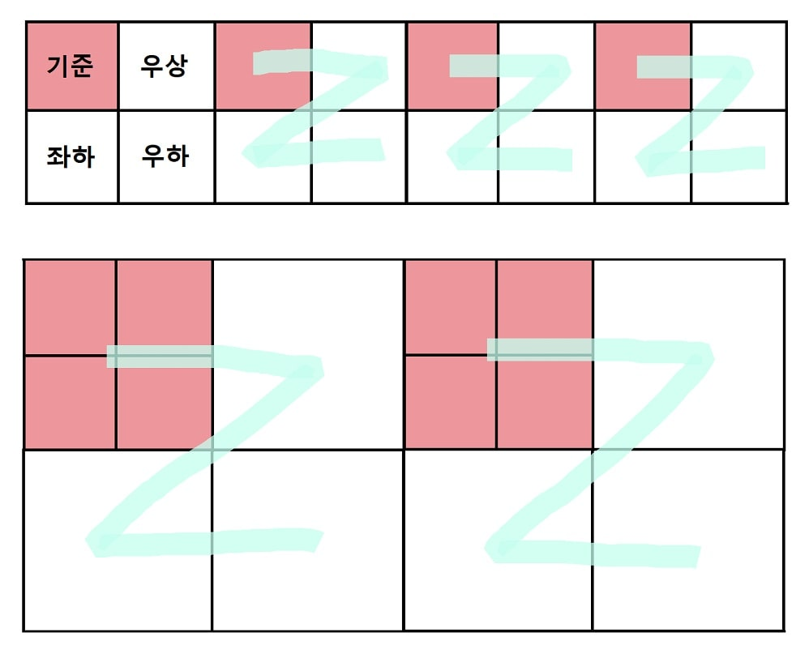
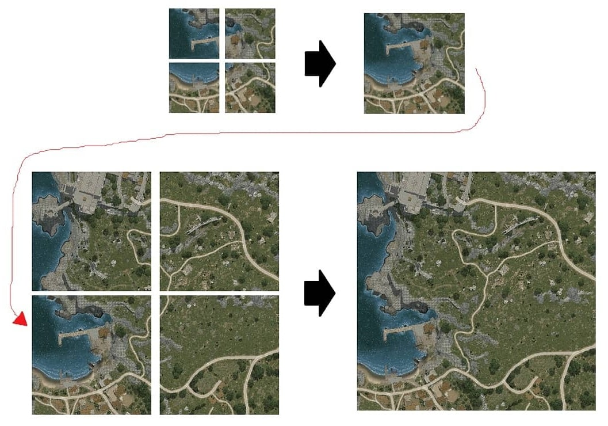
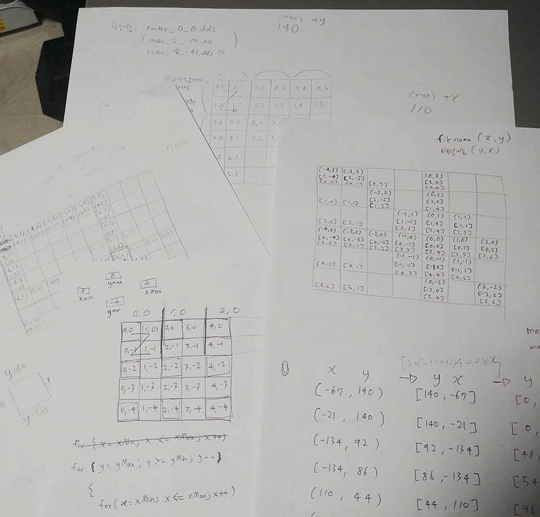
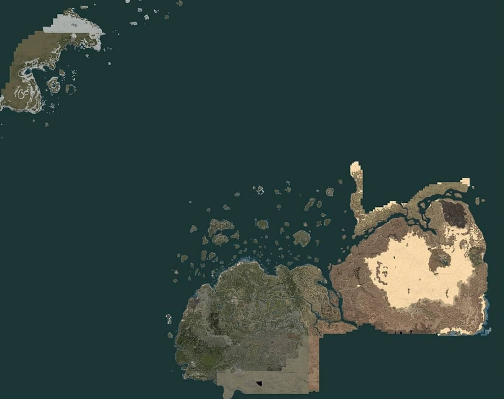
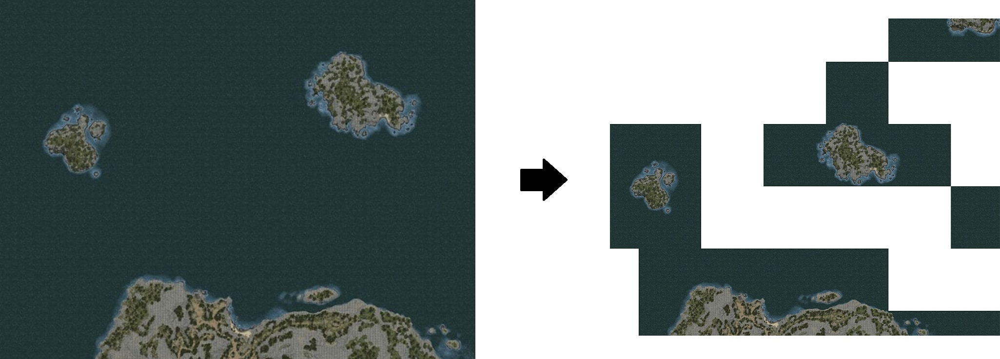
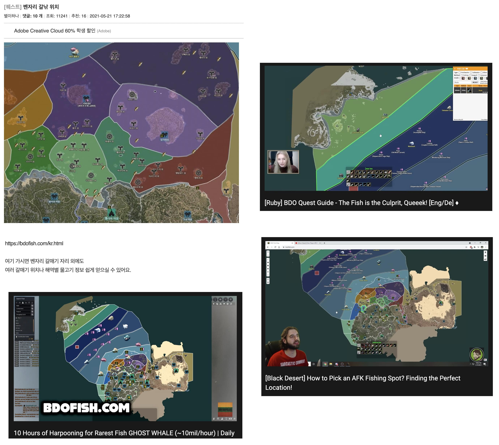

# 약 1년간의 시간을 들여서 완성한 첫 프로젝트 (2019.06 ~ 2020.06)

<center>
  
</center>
<br>

'검은 사막'이라는 게임 안에는 낚시 컨텐츠가 있다. 이 게임은 맵이 광활한 만큼 다양한 물고기들이 여러 지역에 분포되어 있는데, 검은 사막 게임 내, 혹은 홈페이지에도 2D 평면 지도가 없었기 때문에(게임 시스템 상으로는 3D 지도가 전부였다) 유저들은 나름대로 스크린샷을 찍거나 직접 그림을 그려서 낚시터와 어종들에 대한 정보들을 정리해서 공유하곤 했다.

그런데 게임이 패치되면서 변경된 부분도 많았고, 이를 반영하지 않은 상태로 공략들이 방치되다 보니 유저들은 혼동이 오게 되었다. 이 때문에 나 또한 항상 최신 정보들을 얻는데 많은 어려움이 있었다. 그러면서 '누군가 깔끔하게 모든 데이터를 정리해 줬으면 좋겠는데..', '물고기 데이터들로 구글맵스 같은 게 있다면 정말 편할 텐데'라는 생각을 하게 되었고, '내가 직접 만들어보자!'라는 생각과 함께 코딩의 세상에 발을 내딛게 되었다.


# 지도를 구현하다

코딩에 대한 지식이 전무한 상태에서 처음에는 가까운 곳에 있는 학원에서 C++를 배우게 되었다. 여기서 3개월을 다니면서 공부하고 이후에는 웹 개발에 필요한 언어는 Javascript라는 것을 알게 되어 독학의 길로 나서게 되었다.   

내가 구상했던 물고기 지도 작업에는 크게 두 단계로 진행해야 했다.  
1. 하나의 큰 지도 이미지를 만들기
2. 지도 이미지를 바탕으로 웹 페이지를 만들기

그래서 첫 번째로 지도 이미지를 만드는 방법을 생각해 봤다.  
사실 이미 비슷한 지도 사이트가 존재했다. [(https://www.somethinglovely.net/bdo/)](https://www.somethinglovely.net/bdo/){:target='_blank'} 그래서 여기는 어떻게 지도를 구현했나 분석해 보니 검은 사막 내의 미니맵의 조그만 이미지들을 하나로 합쳐서 하나의 큰 지도를 만든 모양이었다. (나중에서야 안 사실이지만 나처럼 굳이 하나의 이미지로 합치지 않고 그냥 개별의 이미지 조각들로 이용해서 지도를 구현할 수 있었던 것 같다..) 그래서 나의 첫 목표로 **이미지를 합쳐주는 프로그램** 을 만들기로 했다.  

우선 게임 클라이언트 안에 미니맵의 이미지가 약 22000개가량이 있었고 각 파일 이름은 x, y 축의 값으로 지어져있었다. 그래서 대략적인 이미지들의 존재 형태를 알아보기 위해서 해당 이미지 조각들의 이름을 불러오면서 좌표에 색칠을 하는 코드를 구현해 봤다.

```c++
for(int y = 0; y < 250; y++)
{
  for(int x = 0; x < 300; x++)
  {
    if(map[y][x] == 0)
    {
      cout << "□"; // 맵의 빈칸
    }
    else if (map[y][x] == 1)
    {
      cout << "■"; // 좌표가 있는 맵
    }
  }
}
```

예전 코드를 살펴보니 이런 식으로 작성했었다. 콘솔 로그에 출력된 결과를 복사해서 메모장에 붙여 넣은 후, 폰트 크기를 제일 작게해서 창을 조절해 주면 이런 신기한 결과가 나온다. 

>[](https://www.youtube.com/watch?v=Mpax1G9O7WI){:target='_blank'}  
>(클릭시 영상으로 이동)  

<center>
  
</center>
<br>

이렇게 메모장으로 확인해보니 신기했다. 


## 1. 하나의 큰 지도 이미지를 만들기
그 당시에는 윈도우를 사용했었기 때문에 이미지를 합쳐주는 기능을 사용하려면 .exe 파일같이 어떤 프로그램을 만들어야 한다고 생각했다. 그래서 찾아보니 **Window Forms** 라는 것을 알게 되었고 정말 막무가내로 만들기 시작했다. (내가 가진 무기라곤 변수/배열/for문 이 3가지 밖에 없었다..) 한두 달 정도 구글링과 유튜브를 보면서 헤딩한 결과 이미지를 합쳐주는 프로그램을 완성시키게 되었다.

구현 방식은 이렇다.  

a. 작은 이미지 조각들의 좌표를 계산해서 기준점이 되는 이미지 한 개 + 나머지 이미지 3개(우상단, 좌하단, 우하단 이미지)를 묶어주고 4개의 이미지들을 -> 하나의 이미지로 변환해 주었다.  
b. 그리고 새롭게 생성된 이미지들을 아까와 같은 방식으로 계속 반복하다 보면 하나의 큰 이미지가 만들어지게 된다!

<center>
  
</center>
<br>

<center>
  
</center>
<br>

<center>
  
<br>
(머리가 안돌아가서 직접 손코딩을 한 흔적..)
</center>
<br>

>[](https://www.youtube.com/watch?v=Z2DXwdUCWg8){:target='_blank'}  
>(클릭시 영상으로 이동)  

이렇게 만들어진 이미지를 약간의 포토샵으로 다듬으면 이런 결과물이 나오게 된다.  

<center>
  
</center>
<br>


## 2. 지도 이미지를 바탕으로 웹 페이지를 만들기

지도 이미지를 완성했다만... 도대체 구글맵과 같은 기능은 어떻게 만들어야 하는가..? 유튜브에 검색을 해보니 아주 기초적인 상황에서도 따라 해볼 수 있는 좋은 튜토리얼이 있었다.  
[https://www.youtube.com/watch?v=EmfE9VyAYcY](https://www.youtube.com/watch?v=EmfE9VyAYcY){:target='_blank'} (정말 이 사람 덕분에 내 지도가 탄생할 수 있었다)  

이 영상에서 설명하는 바로는  
1. 지도로 만들고 싶은 이미지가 준비되어 있어야 하고
2. 해당 이미지를 포토샵 스크립트 [Bramus.GoogleMapsTileCutter](https://github.com/bramus/photoshop-google-maps-tile-cutter/){:target='_blank'} 를 통해 자동으로 지도화 시켜주고(줌인 기능이 되는 사실상 지도의 형태가 한 번에 만들어진다)  
3. [leaflet.js](https://leafletjs.com/){:target='_blank'} 라는 라이브러리와 함께 개발을 이어나가면 된다고 한다.  

>[](https://www.youtube.com/watch?v=xPpRV0TNJ2c){:target='_blank'}  
>(클릭 시 영상으로 이동)  


## 3. 나름의 최적화 시도

얼추 지도의 형태가 갖추어진 후에는 본격적으로 기능들을 구현하고 물고기 데이터를 반영하는 작업을 진행했다. 작업을 하다 보니 고민이 되었던 게 지도를 zoom in/out 할 때마다 이미지 조각들을 실시간으로 요청하고 불러오기 때문에 요청 횟수가 기하급수적으로 늘어났다. 그리고 물고기의 종류도 많은데 이걸 접속할 때마다 백여 개의 이미지들을 요청하는 것도 굉장히 비효율적으로 보였다. 물론 정확한 지식을 가지고 있지는 않았지만 검색해 보니 요청 횟수는 홈페이지의 로딩 속도와도 관련이 있고, 리소스 낭비에도 관련이 있다고 봤었다.  

그래서 이 방법들을 시도했다.  

1. Sprite 기법을 이용  
Sprite 기법이란 여러 개의 이미지들을 하나의 이미지로 만들고, 불러올 때는 각 이미지들의 위치값을 CSS로 지정해서 표현해 주는 방식을 말한다. 이렇게 하게 되면 이미지 파일 요청을 한 번만 해도 되고, 파일의 용량도 하나의 Sprite 이미지의 용량이 개별 이미지 용량의 총합 보다 작다.

2. 지도에서 안 쓰이는 이미지 삭제  
예를 들어 바다 쪽의 지도 이미지 조각들 중에는 온전히 바다의 색상으로만 된 이미지들이 있다(육지와 접점이 없는 이미지). 이런 이미지들을 전부 삭제하고, 웹페이지의 배경 색상을 ```background-color: #바다색상``` 으로 설정해 주어서 채워지게 했다. 실제로 이렇게 하니 파일 전체 용량이 급감했고 속도도 빨라졌다.  
  


3. 데이터와 라이브러리의 .js 파일들도 하나의 파일에 하드코딩하기...  
당시에는 최대한 빠르게 동작하기 위해서는 무엇을 해볼 수 있을까? 고민하면서 이것저것 다 시도해 봤던 것 같다. 홈페이지에 접속했을 때 제일 먼저 보여줘야 하는 데이터들은 하드코딩 해놓으면 더 빨리 로딩할 수 있을 것 같다고 생각했고 (..나중에서야 깨달았지만 이렇게 되면 유지 보수하기가 어려워진다),  
심지어 leaflet.js 파일도 그대로 복사해서 넣었다ㅋㅋ (라이브러리의 import/export 과정 자체도 아예 없애버리는 게 좋지 않나? 라는 생각이 이때는 들어서..). 그리고 이렇게 만들어진 하나의 큰 javascript 파일(약 5500줄)을 minify로 압축시켰다.


# 후기

내가 개발을 하게 될 줄은 이때의 나는 몰랐다. 막연히 해커에 대한 동경(영화에서 컴퓨터 가지고 막 전기 차단하고 그런거ㅋㅋ)만 있었을 뿐이다. 실제로 개발을 해보니 나와 굉장히 잘 맞는 것 같다.

이 프로젝트를 완성시키면서 얻은 건, 한 달 동안 해결하지 못할 것 같은 문제가 2번 정도 있었는데 이걸 해결한 이후에는 어떤 문제가 생겨도 '허허 이것도 쫌 걸리겠구만~' 하면서 여유 있게 받아들이게 된 게 가장 큰 변화인 것 같다!

현재는 검은 사막을 안 하기도 하고 이걸 만들 때 유지 보수를 생각하고 만들지 않아서 업데이트는 못하고 있다.. 가끔 유튜브나 인터넷으로 검색해 보면 사람들이 잘 쓰고 있는 것 같아서 뿌듯하고 괜시리 미안해진다. (업데이트로 새로운 지역과 물고기들 추가된 것 같던데..) 다음에 만드는 것들은 유지 보수가 수월하도록 구조를 짜야겠다!  
끝.

<center>
  
</center>
<br>

[https://github.com/bdofish/bdofish.github.io](https://github.com/bdofish/bdofish.github.io){:target='_blank'}

[https://bdofish.com/](https://bdofish.com/){:target='_blank'}