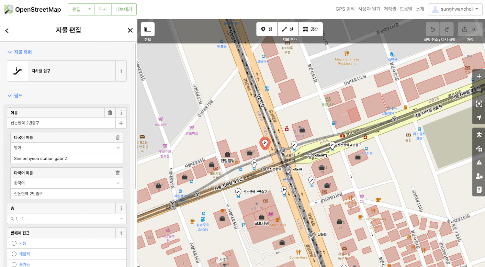
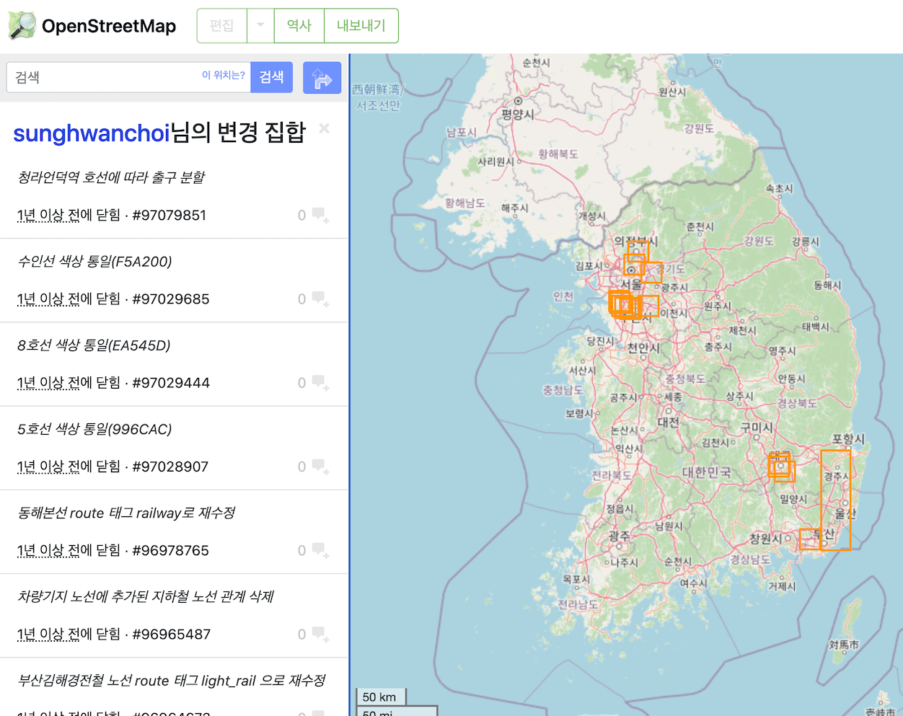
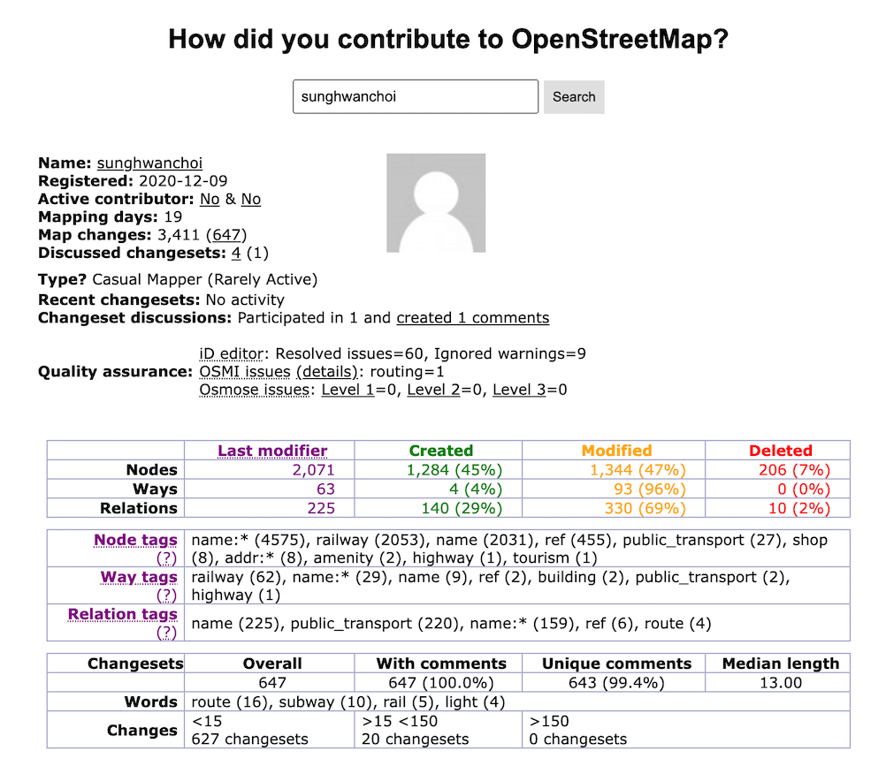

# 한달 동안 대한민국의 모든 지하철역을 훑어보다 (2020.12 ~ 2021.01)

친구의 소개로 전동 킥보드 회사에서 일을 하게 된 적이 있는데, 그때 킥보드 앱에서 잘못 표시되는 지도 정보를 수정해야 하는 작업을 했었다. 이 회사의 앱은 애플과 마찬가지로 타 업체의 지도(구글맵, 네이버지도, 카카오지도..)가 아닌 [오픈스트리트맵 (OpenStreetMap)](https://ko.wikipedia.org/wiki/%EC%98%A4%ED%94%88%EC%8A%A4%ED%8A%B8%EB%A6%AC%ED%8A%B8%EB%A7%B5){:target='_blank'} 이라는 **오픈 소스 방식의 참여형 무료 지도 서비스**를 바탕으로 만들어져있었다.

오픈스트리트맵은 사람들의 자발적인 참여로 만들어져나가는데, 기업이 직접 관리하는 게 아니다 보니 새로운 도로가 생겨도 누군가 나서서 추가하지 않으면 오픈스트리트맵을 사용하는 모든 앱에서는 해당 도로가 표시되지 않는다. 그런 이유에서 오픈스트리트맵의 최신화되지 않거나 잘못된 지하철역의 정보들을 수정하는 미션이 나에게 주어졌다. (왜냐하면 이용자들이 지도 어플을 사용할 때 본인의 현재 위치를 파악하는 데에 제일 많이 참고하는 것 중에 하나가 주변 지하철역이기 때문이다)  

이 작업은 킥보드 회사가 맡아서 해야 할 의무는 아니었지만 이용자들의 편의를 위해 처음 진행하게 된 일이라 메뉴얼도 따로 없었고, 정확한 방법(지도에 정보를 추가할 때 지켜야 하는 양식)도 몰랐다. 그래서 일단 구글링하면서 뭣도 모르고 작업을 하다가.. 내가 작업한 방식이 기존의 틀에 맞지 않았었는지 어떤 고수 유저분(당시 그분은 한국 기여자 랭킹 13위인가 그러셨었다)께서 나에게 메세지로 문제를 지적해 주셨었고, 그 계기를 통해 나는 그분께 이것저것 물어보면서 본격적으로 작업을 시작하게 되었다.

# OpenStreetMap을 작업해보다
외국에서는 활발하게 사람들이 참여하지만 한국은 조금 덜 한 편이다. 그래서 블로그같이 외부적으로 오픈스트리트맵 작성 방식 같은 글들이 많지 않았다. 그래서 최대한 기존에 입력되어 있는 데이터들과 균일한 방식으로 작성해나갔다. (뭔가 [메뉴얼](https://wiki.openstreetmap.org/wiki/Ko:Map_Features#%EC%A7%80%ED%95%98%EC%B2%A0_%ED%91%9C%EA%B8%B0%EC%9D%98_%EC%98%88){:target='_blank'}같은게 있긴한데 이것만 보고는 감이 잘 오지 않는다)

내가 작업한 내용은 이렇다.  

1. 한국의 모든 지하철역에 대한 정보들을 모은다. (ex: [서울교통공사 노선별 지하철역 정보](https://data.seoul.go.kr/dataList/OA-15442/S/1/datasetView.do;jsessionid=6C5B2E5831609CE851EEF1B9291172CB.new_portal-svr-11){:target='_blank'} 같은 자료들을 모은다. 대한민국에 약 1000개 정도 되는 지하철역이 있었던 걸로 기억한다..)  

2. 하나씩 체킹 하면서 모든 지하철역에 잘못된 출구 번호 넘버링 수정, 잘못 위치한 마커 이동, 삭제 및 추가 작업을 진행한다.

 

우선 네이버 지도와 카카오 맵을 킨 후, 각 지하철 역마다 두 개의 지도를 크로스체킹 해서 데이터를 수정/추가했다. 가끔 카카오나 네이버가 다르게 표시되어있는 지하철역들은 거리뷰로 그 근방을 돌아다녀 보거나, 네이버 블로그 등에서 사람들이 올린 지하철역 주변의 사진들을 토대로 참고하였다. (실제로 어떤 곳이 정보는 네이버와 카카오 둘 다 업데이트되지 않았던 지역인데, 그 근처에 살던 주민분께서 블로그에 올리신 글과 사진을 토대로 최신 정보를 반영할 수 있었다)

그런데 지금 보니 나무위키에 이런 내용이 있었다. 음.. 뭐 지하철역 출구 정도는 다른 지도를 참고해도 괜찮지 않을까..?

> "... 두 가지만 명심하면 된다.  
>* 해안선을 함부로 건드리지 않는다.  
>* 네이버 지도, 카카오맵, 구글 지도 같은 상용 지도를 베끼지 않는다."  

아무튼 기존에 맵핑되어있던 데이터들 규격에서 크게 벗어나지 않게끔 주의했고, 왠만하면 불규칙한 텍스트 데이터들을 일관되게 통일시키는 작업과 아예 데이터가 없는 지하철역에 대한 정보 추가 등의 작업을 진행했다. 사실 이 작업 자체는 노가다 반복 작업이었지만 오픈 소스에 기여하는 게 나름 재밌었고 이 지도를 사용하는 이용자들에게 작은 도움이 되었던 것 같아 뿌듯하다.

 

 

 
<a href="http://hdyc.neis-one.org/?sunghwanchoi" target='_blank'>http://hdyc.neis-one.org/?sunghwanchoi</a>

